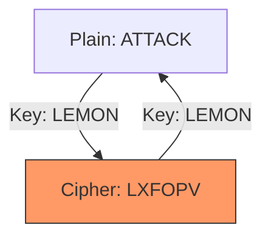

# **LAB 01 (VARIANT B) – THE DIPLOMATIC CABLE**

**Topic:** Vigenère Cipher & Polyalphabetic Substitution.

**Story Context:**
> You are a Diplomat sending a cable to HQ.
> The simple Caesar Shift was broken last week.
> HQ issued a "Code Book" (Keyword). You must add the keyword to your message to scramble the frequencies.

**Tools Required:** [FrequencyAnalyzer.html](https://uncc-fortress.github.io/itis-6200-f26/Lab01_Cryptography/tools/FrequencyAnalyzer.html) (Tab: Vigenère).

---

## **Part 1: Student Identity Parameters (SIP)**

1.  **Plaintext:** `[YourFullName] is learning security`
2.  **Keyword:** Your **First Name**.

---

## **Part 2: The Encryption**

1.  **Action:**
    -   Open Tool -> Tab "Vigenère".
    -   Enter Plaintext and Keyword.
    -   Record Ciphertext.

---

## **Part 3: Deliverables**

**Submission File:** `FirstName_LastName_Lab01B.docx`

### **Screenshot 1: The Setup**
-   **Show:** Tool with your unique input and output.
-   **Markup:** **Red Box** around the Keyword.

### **Screenshot 2: Frequency**
-   **Show:** The Frequency Chart.
-   **Markup:** **Green Arrow** pointing to the *flatness* of the chart compared to Caesar.

### **Part 4: Analysis (Homework Integration)**

1.  **Keyspace:** If your keyword is length $L=5$ (English alphabet), the keyspace is $26^5$. Calculate this number. Is it secure against a modern computer?

### **Part 5: References & Further Reading**

1.  **Computerphile:** [Vigenère Cipher Explained]https://www.youtube.com/watch?v=SkJcmCaHqS0)
    *   *Visual guide to the polyalphabetic square.*
2.  **History:** [The Indecipherable Cipher](https://en.wikipedia.org/wiki/Vigen%C3%A8re_cipher)
    *   *Why Vigenère stood related for 300 years until Kasiski broke it.*
3.  **Visualization:**

